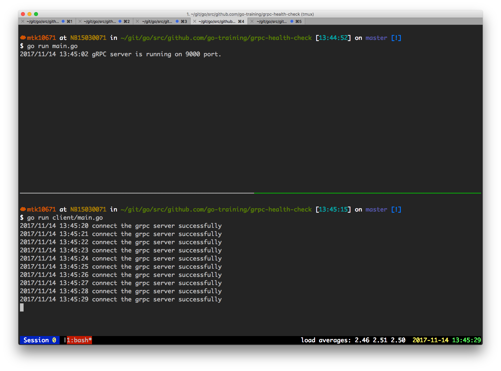

GRPC Health Checking Protocol
================================

## CREDITS
See [go-training / grpc-health-check ](https://github.com/go-training/grpc-health-check)

# grpc-health-check

How to write grpc health check interface. See [GRPC Health Checking Protocol](https://github.com/grpc/grpc/blob/master/doc/health-checking.md)

## Start grpc server

```
$ go run main.go
```

## Run Health Check

```
$ go run client/main.go
```

## ScreenShots

